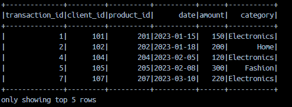
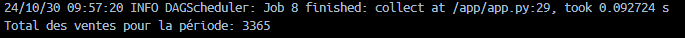
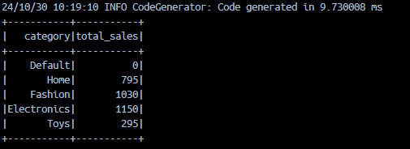
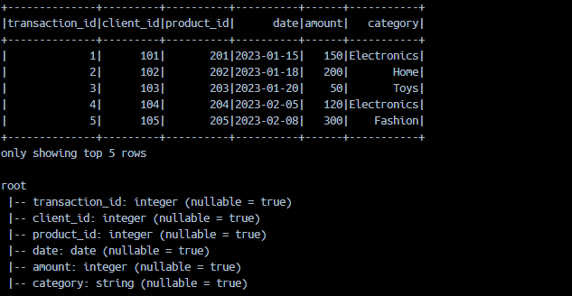

# Sales Analysis with PySpark

## Overview
This demo project uses **PySpark** to analyze sales data from an e-commerce business. The dataset contains details about each transaction, such as product ID, sale amount, and product category. The goal is to perform filtering, aggregation, and identify top-selling products.

## Included Files
- **`sales_data.csv`**: Sales dataset. Example:
  ```plaintext
  transaction_id,client_id,product_id,date,amount,category
  1,101,201,2023-01-15,150,Electronics
  2,102,202,2023-01-18,200,Home
  ```
- **`app.py`**: PySpark script for analysis.
- **`docker-compose.yml`**: Configures Spark Master and Workers.

## Key Objectives & Results
1. **Load and Explore Data**: Load CSV and display initial rows.
2. **Schema and Row Count**: Verify schema and count rows.
3. **Filter Transactions**: Show sales over 100 units.
4. **Handle Null Values**: Replace nulls in `amount` and `category`.
5. **Date Conversion**: Convert `date` to `yyyy-MM-dd` format.
6. **Total Sales**: Compute overall sales.
7. **Sales by Category**: Aggregate sales by category.
8. **Monthly Sales**: Aggregate sales per month.
9. **Top 5 Products**: Identify top 5 products by sales.
10. **Top Product by Category**: Find the best-selling product in each category.

## How to Run
Execute the script in the `spark-master` container:

```bash
docker-compose up -d  # Start containers
docker exec -it spark-master spark-submit /app/app.py
```

The analysis results will be displayed in the console.

## Demo : 

---

---

---

